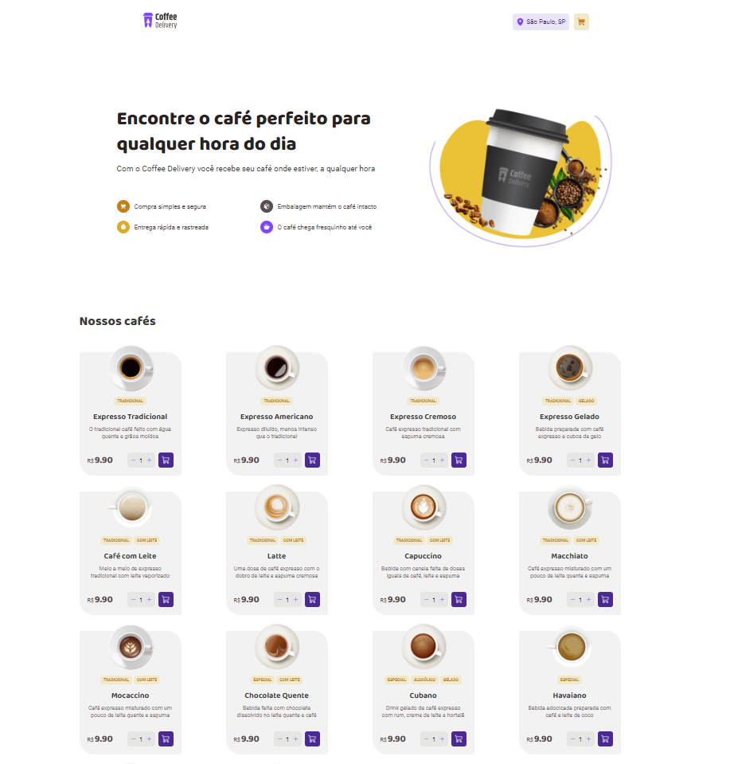
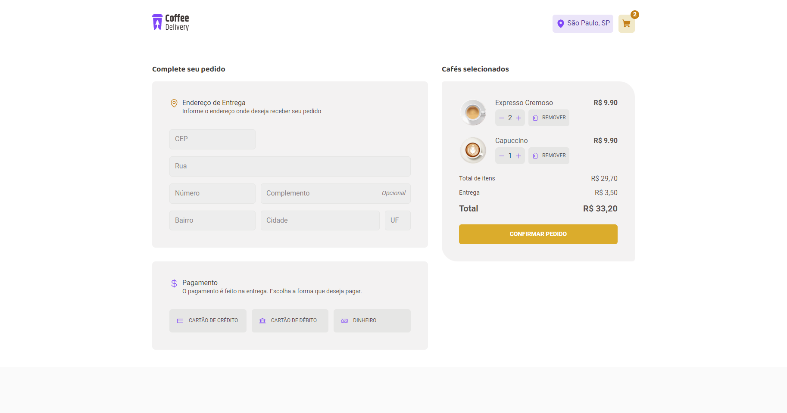
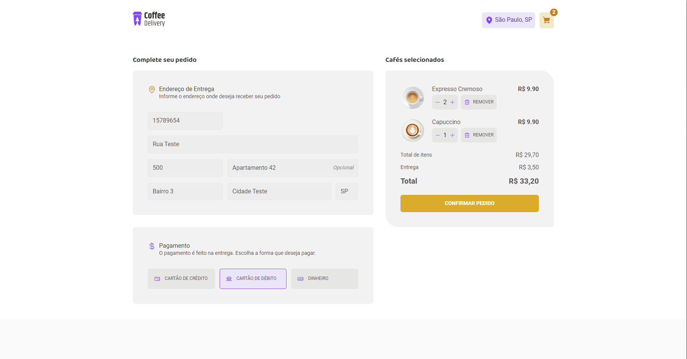
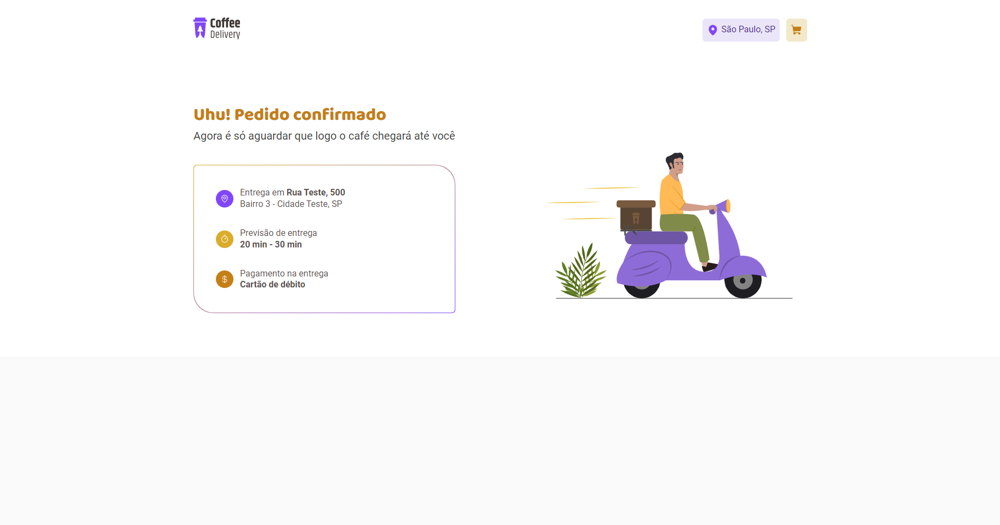

# Coffee Delivery

Este projeto foi desenvolvido como um desafio da trilha Ignite ReactJS da Rocketseat, onde o objetivo foi criar uma interface de compra de variados tipos de cafés, praticando os conceitos de Styled Components, Estados, Contextos, Formulários.

O deploy foi feito utilizando Vercel: 

